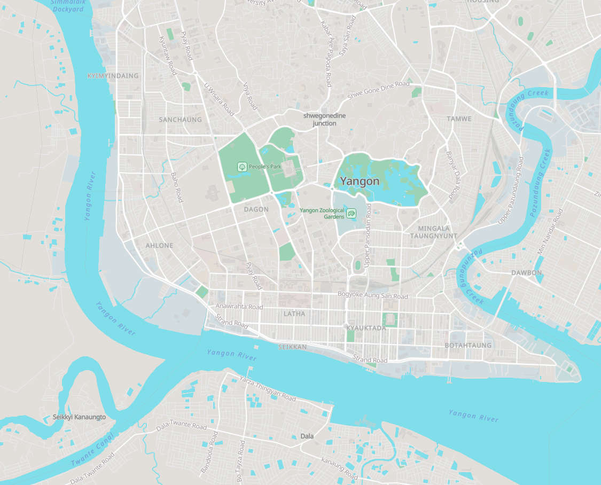

# Yangon Protomaps Example

Example web map for Yangon using Protomaps and the `pmtiles` tool to download a map extract for offline usage.

## Demo

https://wipfli.github.io/yangon/

<a href="https://wipfli.github.io/yangon/"></a>

## Steps

Get the `pmtiles` tool, see https://docs.protomaps.com/pmtiles/cli.

Download a map extract for Yangon:

```
pmtiles extract https://demo-bucket.protomaps.com/v4.pmtiles yangon-protomaps-extract.pmtiles --region bounding-box.geojson
```

This creates a file called `yangon-protomaps-extract.pmtiles` (10 MB).

## Dependencies

Fonts and sprites are loaded from https://protomaps.github.io/basemaps-assets/. You can download all fonts and sprites at https://github.com/protomaps/basemaps-assets.

The MapLibre GL JS JavaScript library and the pmtiles MapLibre plugin are loaded from UNPKG.
